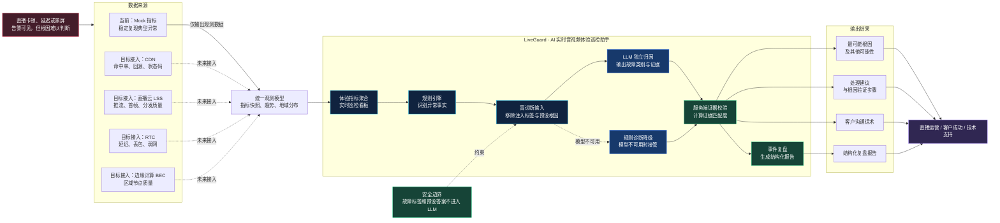

# LiveGuard

> 面向实时音视频业务的 AI 体验巡检助手：将 CDN、直播云、RTC 和边缘节点等底层指标，转化为运营人员可以理解、验证和执行的根因判断、处理建议与复盘报告。

直播出现卡顿、延迟或黑屏时，运营人员通常能看到告警，却很难快速判断问题来自主播网络、CDN 缓存、区域边缘节点还是源站服务。LiveGuard 在云基础设施之上增加一层“体验解释与故障响应能力”，帮助直播运营、客户成功和技术支持更高效地完成异常发现、根因定位、处置沟通和事件复盘。

> **当前能力边界：**业务监控指标和故障均为 Mock；AI 诊断可真实调用百炼 LLM。系统不会把注入故障类型、预设告警原因或答案传给模型，LLM 必须基于数值快照、趋势和地域分布独立完成归因。

## 项目亮点

- **降低实时音视频运维门槛**  
  将延迟、卡顿率、丢包率、首帧时间、CDN 命中率、回源请求和 4xx/5xx 等复杂指标，转化为运营人员可以理解和执行的业务判断。

- **覆盖典型业务与故障场景**  
  覆盖电商直播、在线课堂、企业会议、视频客服和赛事直播五类场景，支持主播弱网、区域链路异常、CDN 命中率下降、源站 5xx、热点资源未预热和推流中断六类典型异常。

- **真实、可解释的 AI 盲诊断**  
  LLM 只能看到经过清洗的观测数据，需要独立输出故障类别、关键证据、最可能根因、其他可能性和验证步骤，避免因提前获得注入标签而导致诊断结果虚高。

- **服务端诊断守护机制**  
  不采用模型自报的主观置信度，而是由服务端根据指标组合计算“证据匹配度”；缺乏数据支撑的模型结论会被拒绝并切换至规则诊断。

- **完整的故障响应闭环**  
  打通“体验监控—异常告警—AI 诊断—根因验证—事件复盘”流程，并生成处理建议、客户沟通话术和结构化复盘报告。

- **稳定的降级与透明展示**  
  LLM 未配置、请求超时、返回格式异常或结论证据不足时，系统会自动使用基于观测数据的规则诊断，并在页面明确展示诊断来源。

## 技术实现

- **前端：**React、TypeScript、Vite、Ant Design、Apache ECharts。
- **后端：**FastAPI、Pydantic、规则引擎与 Mock 指标生成器。
- **AI 编排：**LangChain 接入百炼 OpenAI 兼容接口，LangGraph 编排数据清洗、模型调用、结构化解析和结果构造。
- **可靠性保障：**诊断输入白名单、注入标签隔离、结构化输出校验、服务端证据评分和规则降级。

## 未来规划

- **接入统一遥测数据接口**  
  抽象标准数据源协议，在保留 Mock 模式的同时，支持外部系统推送指标快照、趋势、地域质量和告警事件。

- **对接百度智能云基础设施**  
  增加 CDN、音视频直播 LSS、RTC 和边缘计算 BEC 适配器，逐步使用真实云监控指标和日志替换模拟数据。

- **建设实时事件与历史资产**  
  引入 WebSocket/SSE、数据库和事件中心，实现实时指标推送、故障历史归档、相似事件检索和报告管理。

- **增强知识驱动的诊断能力**  
  建设故障知识库与运维手册 RAG，结合历史案例、处置手册和实时日志，提高建议的针对性与可解释性。

- **建立可量化的诊断评测体系**  
  使用脱敏故障样本评估分类准确率、证据引用正确率、建议采纳率和平均定位时间，持续校准规则与模型。

- **完善企业级安全与治理**  
  增加敏感字段脱敏、多租户、权限控制、审计记录和人工确认机制，推动产品从原型演进为企业级运维 Copilot。